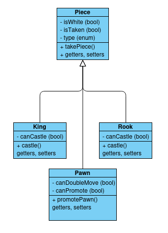

# Program Design

## Overview

This program will consist of 2 parts, a very simple UI, and a chess engine. The UI will consist of a formatted array being output to the console, and the user can then input a move. THe other side will be a chess engine that the user can play against, instead of both sides being played by the human.

## Requirements

1. **User Interface (UI):**
    - The UI should be simple and intuitive.
    - The UI should display a formatted array representing the chess board.
    - The UI should accept user input for moves.

2. **Chess Engine:**
    - The engine should be capable of playing a valid game of chess.
    - The engine should respond to user moves with its own moves.
    - The engine should follow all standard chess rules.

3. **Interaction:**
    - The user should be able to play against the chess engine.
    - The game should be turn-based, alternating between the user and the engine.

## Architecture

1. **Components:**
    - Chess Engine - Will analyse the current state of the board and suggest the best move in it's opinion
    - Simple Chess UI - Will show the user the position of the board and allow them to make their move
    - Validity checker - Will take the state of the board, the move requested and check whether it is valid. This should also be used in the engine to ensure moves taken are valid
    - Backend board state information - Will provide the state of the board to the engine and the UI system, to present to the user

2. **Interactions:**
    - The UI will be presented to the user, who can choose black, white or random
    - The user will provide a move
    - The move will be checked for legality
    - The board position will be updated
    - The board is processed by the engine and it's move is made
    - This is repeated until a win/draw condition is met by one of the players 

## Class Diagram

## Sequence Diagrams

Include sequence diagrams to show the flow of control and interactions between objects in different scenarios.

## User Interface Design

Describe the user interface design, including any wireframes or mockups.

## Data Model

Explain the data model of the program, including the entities and their relationships.

## Algorithms

The algorithms used by the engine will be decided after the UI and game functions have been implemented

## Testing

Outline the testing strategy for the program, including unit tests, integration tests, and any other relevant testing approaches.
